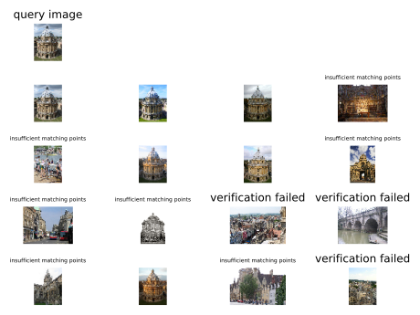
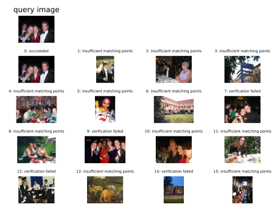

# Bag of Words for Image Retrieval

## Features
- Inverted file index for reconstructing boW of images from dataset
- RANSAC based spatial verification
- Vocabulary tree using hierarchical k-means
- Relevance feedback based on query point movement (does not coexist with voc tree, in branch `feedback`)

## Usage
 
```shell script
usage: search.py [-h] -i IMAGE [-f]

optional arguments:
  -h, --help            show this help message and exit
  -i IMAGE, --image IMAGE
                        Path to query image
```

```shell script
usage: findFeatures.py [-h] -t TRAININGSET

optional arguments:
  -h, --help            show this help message and exit
  -t TRAININGSET, --trainingSet TRAININGSET
                        Path to Training Set
```

## Demo






