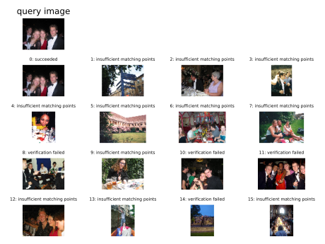

# Bag of Words for Image Retrieval

## Features
- Inverted file index for reconstructing boW of images from dataset
- RANSAC based spatial verification
- Vocabulary tree using hierarchical k-means
- Relevance feedback based on query point movement (does not coexist with voc tree, in branch `feedback`)

## Usage
 
```shell script
usage: search.py [-h] -i IMAGE [-f]

optional arguments:
  -h, --help            show this help message and exit
  -i IMAGE, --image IMAGE
                        Path to query image
```

```shell script
usage: findFeatures.py [-h] -t TRAININGSET

optional arguments:
  -h, --help            show this help message and exit
  -t TRAININGSET, --trainingSet TRAININGSET
                        Path to Training Set
```

## Demo


```shell script
100%|█████████████████████████████████████| 1000/1000 [00:00<00:00, 2944.18it/s]
Do you want to continue to give feedback?
$ y
y
Please enter the indices of your desirable images, starting from 0 and split by space!
0 5 11 12 14
0 5 11 12 14
100%|█████████████████████████████████████| 1000/1000 [00:00<00:00, 3924.76it/s]
This is the new result!
Do you want to continue to give feedback?
$ n
```


